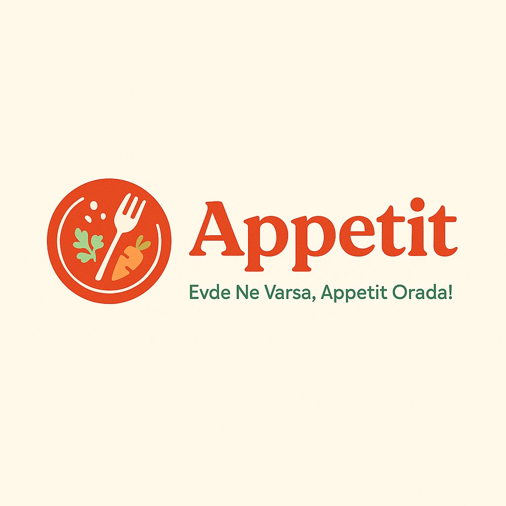

## Appetit
**Evde Ne Varsa, Appetit Orada!**

Bir yapay zeka destekli uygulama ile evde atık olabilecek malzemeleri değerlendiren, Gemini AI kullanarak tarifler üreten ve bu tarifleri sera gazı salınım gruplarına göre kümelendirerek kullanıcıların sürdürülebilirlik bilincini artırmayı hedefleyen bir proje.

---

## Description

Bu proje, evdeki artık malzemeleri (geç bozulabilir sebze artıklarından bayat ekmeğe kadar) değerlendirmek için Gemini AI modelini kullanarak yaratıcı yemek tarifleri oluşturur. Her tarif için tahmini sera gazı (GHG) salınım değerleri hesaplanır ve benzer emisyon profiline sahip tarifler kümelenir. Böylece kullanıcılar hem gıda israfını azaltır hem de karbon ayak izlerini takip ederek daha sürdürülebilir seçimler yapabilir.

## Projeyi Hazırlayanlar

* **Özgün Büyüktanır** – AI Developer
* **Yakup Sinan Gedikli** – Backend
* **Zeynep Feyza Atabey** – Frontend/Concept

## Gereksinimler

* Python 3.8+
* `requirements.txt`

## Nasıl Çalıştırılır

- .env klasörü oluşturun. 
- İçine gemini_keys.env dosyası oluşturun,
*"""GEMINI_API_KEY=**************************"""*
şeklinde doldurun ve main.py isimli python scripti çalıştırın.

## Ekstra bilgiler

jupyter notebook ile hazırlanan kümeleme algoritması models bölümünde mevcuttur.
Kümeleme için kullanınlan data: 
[Dataset: Sustainable Diet – The Database of Carbon Footprint and Embodied Nutrition of 388 Popular Recipes](https://figshare.com/articles/dataset/Sustainable_diet_the_database_of_carbon_footprint_and_embodied_nutrition_of_388_popular_recipes/22581394?file=42968395)

**NOT.1:** Gemini AI promptu yanlış anlayabilir ve düzgün olmayan bir şekilde metin döndürebilir.

**NOT.2:** Kümeleme algoritmasının eğitim değerleri ile kullanılan veri kaynağının değerleri farklı olduğu için kümelemede aynı sınıftan sonuçlar alınabilir. İlerleyen süreçte veri toplanarak güncellenecektir. 

## Lisans

CC0

## İletişim

Projeyle ilgili sorularınız için:

* **Özgün Büyüktanır E-posta:** [ozgunbuyuktanir@gmail.com](mailto:ozgunbuyuktanir@gmail.com)
* **Yakup Sinan Gedikli E-posta:** [y.sinang58@gmail.com](mailto:y.sinang58@gmail.com)
* **Zeynep Feyza Atabey E-posta:** [zeynepfeyza4@gmail.com](mailto:zeynepfeyza4@gmail.com)

